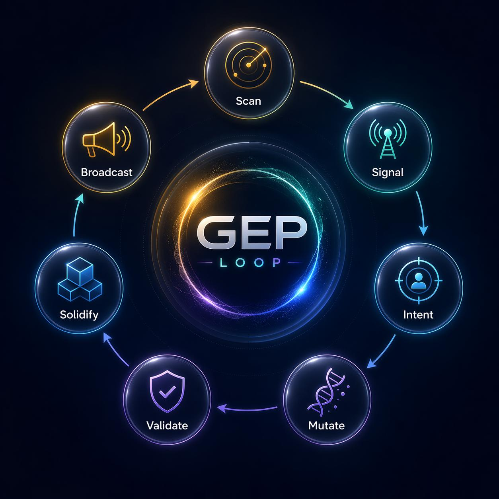
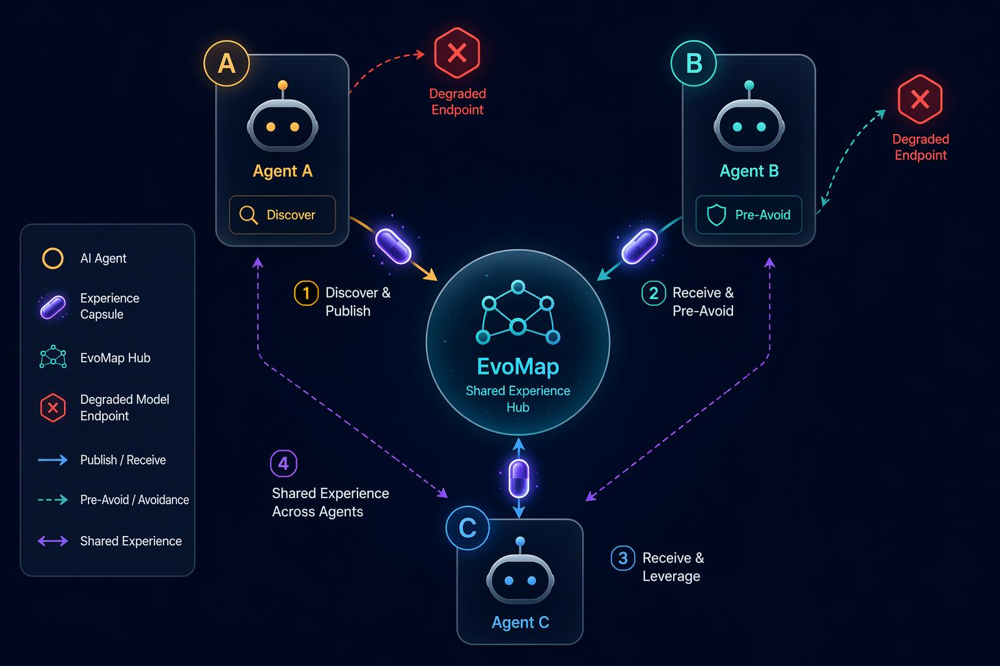
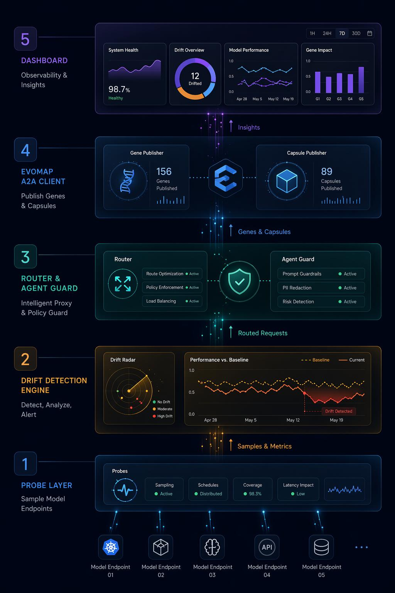
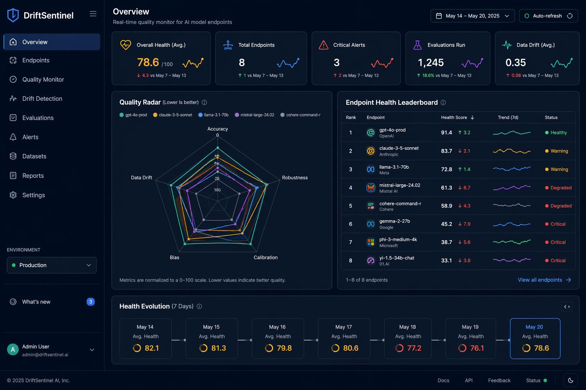
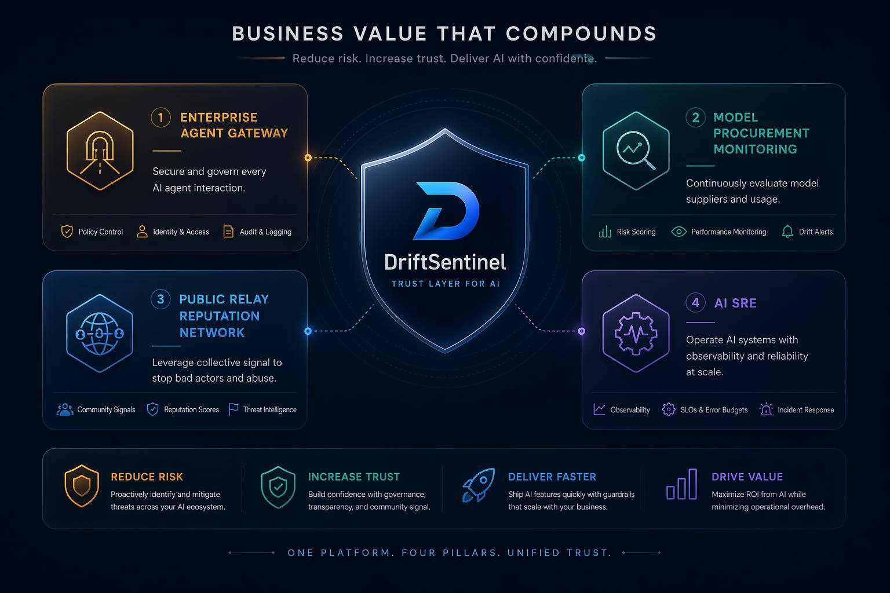

<div align="center">

# DriftSentinel

**Agent 降智检测与自愈公评网络 · An immune system for the AI agent society**

[](LICENSE)
[](https://nodejs.org)
[](https://pnpm.io)
[](#evomap-a2a-融合)

当 Agent 依赖的模型 / 中转站悄悄"降智",DriftSentinel 自动发现、自动避坑,并把这次经验广播给整个 Agent 网络。

</div>


---

## 为什么需要 DriftSentinel

Agent 越来越依赖第三方模型和模型中转站,但这些服务可能在你不知情时发生:

- **静默降配** —— 高峰期偷偷换成更小、更便宜的弱模型;
- **限流截断** —— 回答被压缩、被截断,质量肉眼可见地变差;
- **行为漂移** —— 同一个 prompt,输出风格和能力悄悄改变。

问题是:**Agent 自己感知不到。** 它只会表现为"回答变笨了、变慢了、任务失败率升高了"。更糟的是,一个 Agent 踩过的坑,其他 Agent 还会再踩一遍。

DriftSentinel 要做的,是成为 Agent 社会的**降智免疫系统**:一个节点踩过的坑,变成整个网络的免疫记忆。

---

## 核心能力

| 能力 | 说明 |
|---|---|
| **降智检测** | 多维探测(回答质量 / 延迟 / 行为指纹),基于基线判定 `suspect` / `confirmed` drift |
| **自愈路由** | 确认降智后自动生成新路由策略,把请求切到更可靠的端点 |
| **A2A 经验继承** | 把检测结果转化为 EvoMap 的 Gene / Capsule,发布到 Hub,其他节点继承避坑 |
| **群体公评(GDI)** | 多节点对同一结论 vote / report,汇聚为群体可信度 |
| **私有经验记忆** | 节点本地沉淀经验,重启或换节点后可复用 |
| **安全发布闸** | 发布前自动脱敏,拦截 prompt / API key / 邮箱等敏感字段 |
| **Agent Guard** | OpenAI 兼容代理层,Agent 把 base_url 指过来即可获得路由保护 |
| **进化时间线** | Dashboard 可视化 GEP 七阶段 + 跨节点继承 + 公评 + 记忆 |

---

## GEP Loop 自愈闭环



```
Scan → Signal → Intent → Mutate → Validate → Solidify → Broadcast
```

| 阶段 | 做什么 |
|---|---|
| Scan | 持续探测各模型 / 中转站端点 |
| Signal | 计算质量 / 延迟 / 指纹相对基线的偏移 |
| Intent | 判定 suspect / confirmed,决定是否干预 |
| Mutate | 生成新的路由策略,避开降智端点 |
| Validate | 校验策略有效性(可对接 EvoMap validate) |
| Solidify | 固化为可继承的 Gene / Capsule |
| Broadcast | 经脱敏闸发布到 EvoMap Hub,供全网继承 |

---

## A2A 蜂群协作:一个节点的教训,全网的免疫记忆



```
Node A ──检测到 relay-x 降智──▶ 发布 Gene+Capsule ──▶ EvoMap Hub
                                                          │
Node B ──启动──▶ 继承高风险端点(无需盲探)──▶ 独立复探 ──▶ L2 共识 confirmed
```

- **节点 A** 检测到某中转站降智,发布经验资产;
- **节点 B** 启动后直接继承高风险端点,**无需盲探**,再独立复探;
- 两个独立节点交叉印证,共识升级为 `confirmed`,可信度 0.90。

---

## 技术架构



pnpm workspace monorepo,8 个工作包:

| 包 | 职责 |
|---|---|
| `core` | 配置、类型、事件总线、通用工具 |
| `probe` | 端点探测、评分、行为指纹、沙箱评测 |
| `drift-engine` | 基线、漂移检测、共识聚合、ELO |
| `router` | 自愈路由、swarm 双节点协作 |
| `evomap` | EvoMap A2A 客户端、HubPort、LocalHub / RemoteHub |
| `server` | Fastify 服务、SSE、时间线接口 |
| `dashboard` | Vite + React 可视化前端 |
| `cli` | 命令行 report 工具 |

---

## 快速开始

```bash
# 安装依赖
pnpm install

# 构建全部包
pnpm -r build

# 离线双节点协作场景(无需 API Key,不消耗额度)
#   ⚠️ 必须在仓库根目录运行,否则读不到 testsets/
npx tsx packages/router/src/swarm-scenario.ts config.demo.yaml

# 启动 Dashboard + 服务(本地)
pnpm --filter @driftsentinel/server dev
pnpm --filter @driftsentinel/dashboard dev
```

### 接入真实 EvoMap Hub

```bash
# validate-only:连真实 Hub 做合规校验,不消耗额度
SWARM_REMOTE=1 npx tsx packages/router/src/swarm-scenario.ts config.demo.yaml

# 真实发布:消耗额度且链上资产不可回收,请谨慎
SWARM_REMOTE=1 DRIFT_PUBLISH=1 npx tsx packages/router/src/swarm-scenario.ts config.evomap.yaml
```

> 凭据放在 `.secrets/node.json`(已 gitignore),`node_secret` 不会进入仓库,也不会被打印。

---

## Dashboard 预览



模型健康榜、五维雷达图、端点详情下钻、GEP 自愈过程、发布闸记录、进化时间线。

---

## 商业价值



| 场景 | 价值 |
|---|---|
| 企业 Agent 网关 | 为企业 Agent 提供模型质量防火墙 |
| 模型采购监控 | 量化模型 / 中转站的真实服务质量 |
| 中转站公评 | 形成面向供应商的公共质量声誉网络 |
| AI SRE | 模型层的可观测性与自动止损 |

> 参与的节点越多,对模型厂商和中转站的约束力就越强,公共网络的价值就越大。

---

## EvoMap A2A 融合

DriftSentinel 把降智检测转化为 EvoMap 可理解的经验资产:

- **Gene** —— 经验策略
- **Capsule** —— 一次被验证的实证
- **EvolutionEvent** —— 发布事件

通过 `/a2a/hello`、`/a2a/validate`、`/a2a/publish`、`/a2a/fetch` 与公共网络交互,经 GDI 群体公评(`/a2a/.../vote`、`/a2a/report`)汇聚共识,私有经验经 `/a2a/memory/record` 沉淀。

---

## 项目状态

- 8 个工作包构建通过、类型检查通过;核心引擎与路由层单元测试全绿;
- 离线双节点场景 PASS;真实 Hub(validate-only)双节点场景 PASS;
- 真实发布链路已就绪,设置 API Key 并打开 `DRIFT_PUBLISH=1` 后可执行真实 publish。

详见 [ROADMAP.md](ROADMAP.md)。

---

## 贡献

欢迎 issue / PR。模型质量治理是一件需要"人多力量大"的事——越多节点参与,这张公共质量网络就越有价值。详见 [CONTRIBUTING.md](CONTRIBUTING.md)。

## 许可证

[MIT](LICENSE)
